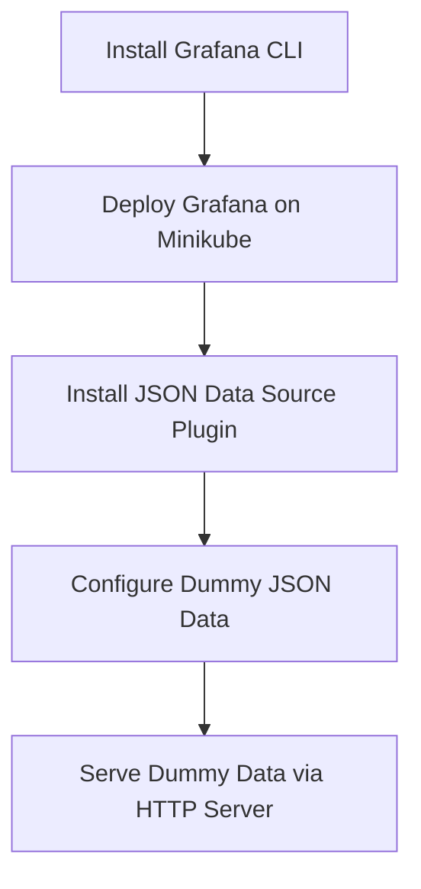

# Formula

🚀✨

Technical procedures and documentation

## Summary of Documentatio

| File                                   | Description                                                                                     |
|----------------------------------------|-------------------------------------------------------------------------------------------------|
| `2_INSTALL_GRAFANA_CLI.MD`             | Instructions to install Grafana CLI, including adding GPG keys and starting Grafana service.     |
| `3_GRAFANA_INSTALL_BITNAMI_OUTPUT.MD`  | Steps to deploy Grafana on Minikube using Bitnami's Helm chart and access the Grafana interface.  |
| `4_ADD_DUMMY_DATA.MD`                   | Guide to install the JSON data source plugin in Grafana and configure it with dummy data.        |
| `ALTERNATIVE_DUMMY_DATA_FOR_TESTING.MD` | Provides alternative dummy JSON data and instructions to serve it using a Python HTTP server.     |
| `DUMMY_DATA.JSON`                       | JSON file containing dummy data for testing purposes.                                          |
| `GRAFANA_CLI_INSTALL.SH`                | Bash script to install Grafana CLI by adding GPG keys and updating the package list.             |

## Process Flow

